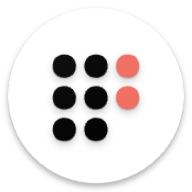

  

# Right Calendar/AlRight Calendar
  

Open-source calendar built for privacy. No ads. No trackers. No unnecessary permissions. Just a fast, reliable way to manage your schedule with a fully customizable interface — switch themes, adjust layouts, and make it yours. Day, week, month, year, and agenda views included. Your events stay on your device, always   

## ☕ Support the Project

If you find **Right Calendar/AlRight Calendar** useful and would like to support its development, consider
buying me a coffee! Your support helps me maintain and improve this project.

*Every contribution, no matter how small, helps keep this project alive and growing! ❤️*   

*Based on [Simple Calendar](https://github.com/SimpleMobileTools/Simple-Calendar), [Fossify Calendar](https://github.com/FossifyOrg/Calendar).*
